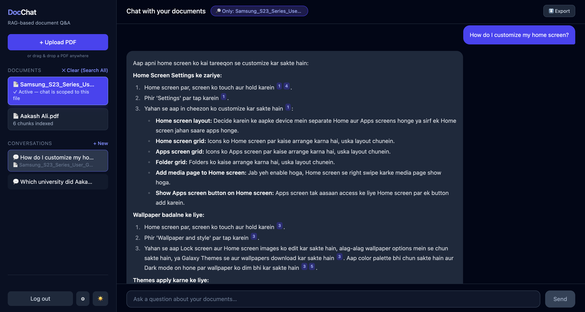
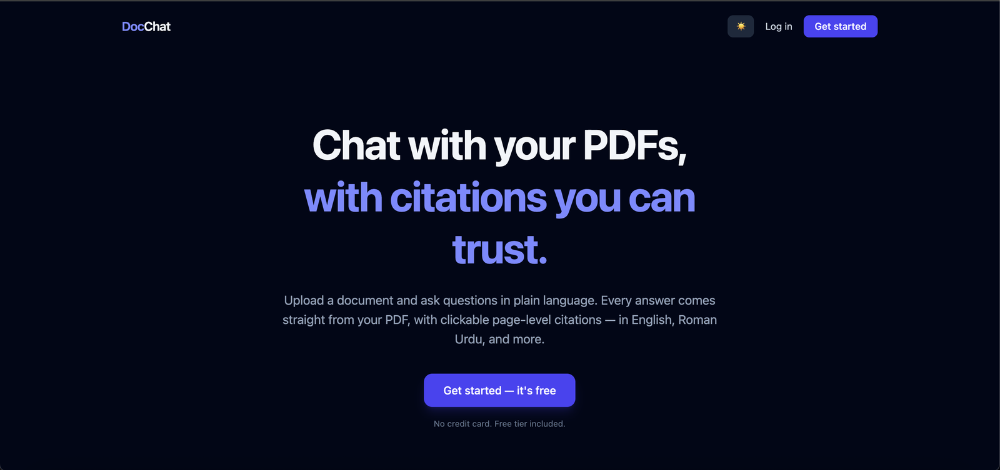
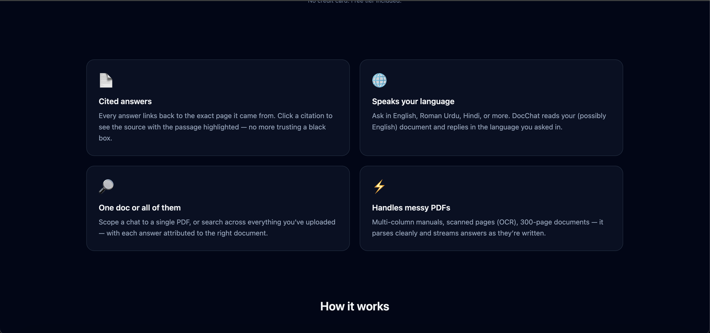
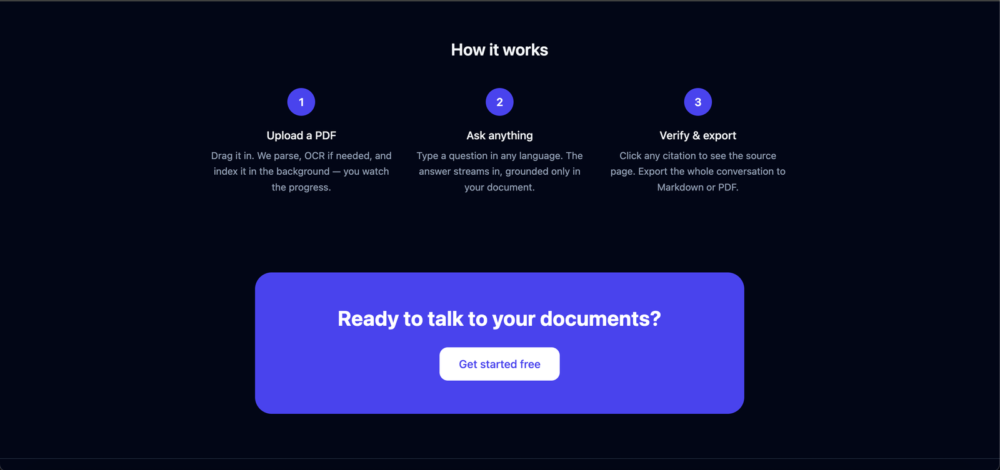
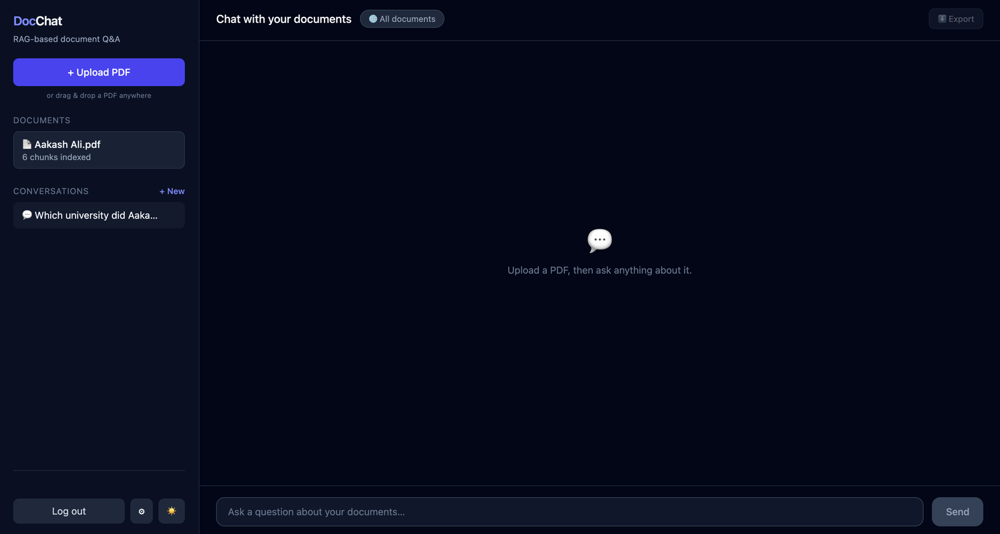
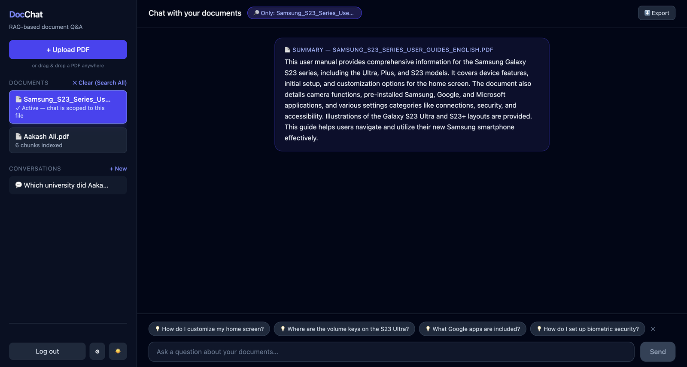

<div align="center">

# 📄 DocChat

**Chat with your PDFs — with citations you can trust.**

Upload a document, ask questions in plain language, and get answers grounded in your PDF —
with clickable, page-level citations. In English, Roman Urdu, and more.

[](https://doc-chat-theta-three.vercel.app)
[](https://github.com/aakash28-pixel/DocChat/actions/workflows/ci.yml)

[](https://react.dev)
[](https://fastapi.tiangolo.com)
[](https://langchain.com)
[](https://trychroma.com)
[](https://supabase.com)
[](https://ai.google.dev)

**🌐 Try it live → [doc-chat-theta-three.vercel.app](https://doc-chat-theta-three.vercel.app)**



*A question asked in Roman Urdu, answered from an English Samsung manual — every claim
tagged with a citation chip that opens the exact source page.*

</div>

---

## ✨ Why DocChat

Most "chat with your PDF" tools are black boxes — you get an answer and have to hope
it's real. DocChat is built around **verifiability**:

- 🔍 **Page-level citations** — every answer carries `[1]`-style chips; click one and a
  built-in PDF viewer (pdf.js) opens the exact cited page with the source snippet.
- 🌐 **Multilingual by design** — ask in English, Roman Urdu, or Hindi; DocChat reads
  your (possibly English) document and replies in the language you asked in.
- 📚 **One doc or all of them** — scope a chat to a single PDF, or search across your
  whole library with per-document attribution.
- ⚡ **Handles messy PDFs** — multi-column manuals, scanned pages (Tesseract OCR
  fallback), 300-page documents; parsed per-page and streamed token-by-token (SSE).
- 🧠 **Real product features** — persistent conversations, auto-summary on upload,
  AI-suggested starter questions, drag-and-drop with staged ingestion progress,
  Markdown/PDF export, light/dark theme, mobile-ready.
- 🔒 **Security first** — Supabase JWT on every endpoint, strict per-user isolation in
  both Postgres (RLS) and the vector store, Cloudflare Turnstile CAPTCHA, per-user rate
  limits, magic-byte upload validation, and a 25-test security suite in CI.

## 📸 Screenshots

### Landing page

| Hero | Features | How it works |
| :-: | :-: | :-: |
|  |  |  |

### Inside the app

| Clean workspace | Auto-summary + suggested questions |
| :-: | :-: |
|  |  |

## 🚀 How it works

```
 PDF upload ──▶ per-page parse (PyMuPDF) ──▶ OCR fallback (Tesseract)
                      │
                      ▼
        chunk (LangChain) ──▶ embed locally (MiniLM) ──▶ ChromaDB
                                                            │
 question ──▶ history-aware retrieval (top-k, per-user) ────┤
                                                            ▼
              Gemini (numbered context) ──▶ SSE stream ──▶ answer + [n] citations
```

1. **Upload** — parsing, OCR, chunking, and embedding run as a background job; the UI
   polls real staged progress (`parsing → chunking → embedding → ready`).
2. **Ask** — retrieval is scoped to *your* documents (and optionally one file); the LLM
   sees numbered passages and must cite them.
3. **Verify & export** — click citations to view the source page; export the whole
   conversation to Markdown or PDF.

## 🛠️ Tech stack

| Layer | Choice |
| --- | --- |
| Frontend | React 19 + Vite, Tailwind CSS v4, pdf.js, react-markdown |
| Backend | FastAPI (Python), LangChain, SSE streaming, slowapi rate limiting |
| Vector store | ChromaDB (local, MiniLM embeddings — no embedding API cost) |
| Auth + DB | Supabase (JWT auth, Postgres with Row Level Security) |
| LLM | Google Gemini (`gemini-2.5-flash`), Claude-ready via env switch |
| OCR | Tesseract (per-page fallback for scanned documents) |
| Anti-bot | Cloudflare Turnstile CAPTCHA |
| Observability | Structured logging, optional Sentry (frontend + backend) |
| CI/CD | GitHub Actions (pytest security suite + lint + build), Vercel auto-deploy |
| Containers | Dockerfiles + docker-compose + Caddy (auto-HTTPS) for VPS deployment |

## 🏁 Getting started (local)

**Prerequisites:** Python 3.9+, Node 20+, Tesseract (`brew install tesseract`), a
[Supabase](https://supabase.com) project (free), a Gemini API key (free tier works).

```bash
git clone https://github.com/aakash28-pixel/DocChat.git
cd DocChat

# ── backend ──
cd rag-backend
python3 -m venv venv && ./venv/bin/pip install -r requirements.txt
cp .env.example .env        # fill in LLM_API_KEY + Supabase creds
# apply migrations/0*.sql in the Supabase SQL editor (once)
./venv/bin/uvicorn main:app --reload --port 8000

# ── frontend ──
cd ../rag-frontend
npm install
cp .env.example .env        # fill in the VITE_SUPABASE_* values
npm run dev                 # → http://localhost:5173
```

Run the security test suite:

```bash
cd rag-backend && ./venv/bin/pytest test_security.py -v
```

## 🔐 Security model

- Identity comes **only** from the validated Supabase JWT — never from request bodies.
- Tenant isolation is enforced twice: Postgres RLS policies *and* `user_id` filters on
  every vector query (with IDOR tests proving user A can't read/delete user B's data).
- Uploads are validated by extension, MIME, **magic bytes**, size, and page count;
  filenames are sanitized before touching the filesystem.
- Per-user rate limits (burst + daily quotas) protect the LLM budget.
- Raw provider errors are never shown to users; full errors go to server logs only.

## 📦 Deployment

See **[DEPLOYMENT.md](DEPLOYMENT.md)** for the full guide, including a $0 launch path
(Vercel + tunnel) and a one-command VPS setup (`docker-compose` + Caddy auto-HTTPS),
plus migrations, backups, and cost estimates.

```bash
./scripts/go-live.sh   # start backend + tunnel with one command
```

---

<div align="center">

Built with passion by **[Aakash Ali](https://github.com/aakash28-pixel)** 🇵🇰

*If this project helped you, a ⭐ means a lot!*

</div>
